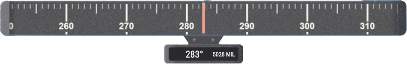
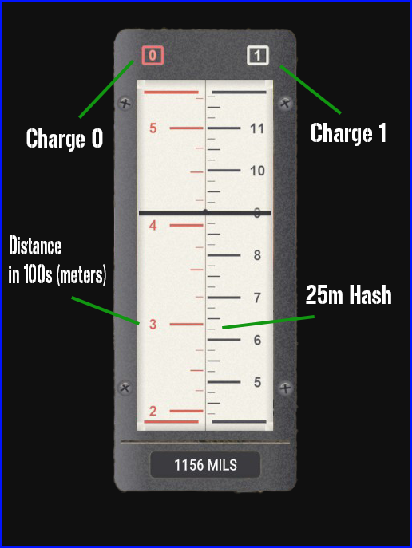

# M224A1 60mm Handheld Mortar

**A lightweight, shoulder-carried, inventory-loaded mortar system built to move with the Forward Line of Troops. Direct-lay and organic indirect fires, one gunner, no crew.**

*Thank you to everyone who assisted in making this possible.*

Bug reports, issues, and suggestions belong in the proper channels of the [Discord](https://discord.gg/PFxWc9W7zD).

---

## Contents

- [Overview](#overview)
- [Technical Specifications](#technical-specifications)
- [Rounds](#rounds)
- [User Manual](#user-manual)
  - [Inventory](#inventory)
  - [Placement](#placement)
  - [Fire Control](#fire-control)
  - [Reading the UI](#reading-the-ui)
  - [Firing](#firing)
- [Safety Notes](#safety-notes)

---

## Overview

This is **not** a vanilla mortar. It is carried and assembled by a single person from the launcher slot, loaded by the gunner without ever leaving the gun, and fired without a gunner's sight. Direct lay, the way a handheld 60 is meant to be run.

- Carried in the **launcher slot**, placed via keybind using a live **ghost preview**
- Once deployed, the M224 acts as a **turret**. Reload pulls directly from the gunner's inventory
- **Reposition** the tube or pick it up through look-interactions, no menus
- Custom animations, particle effects, and fire-control UI

---

## Technical Specifications

| Specification | Value |
| --- | ---: |
| Tube weight | 6 kg |
| Minimum range | 70 m |
| Maximum range | 400 m (charge 0) / 1,300 m (charge 1) |
| Traverse | ±45° |
| Elevation | 45° to 80° |
| Reload time | 2 s |
| Maximum rate of fire | 30 rds/min |

---

## Rounds

| | **M720A1 HE** | **M722 WP** |
| --- | :---: | :---: |
| **Type** | High Explosive | White Phosphorus |
| **Detonation** | Impact or Airburst | Impact only |
| **Charge** | 0 / 1 | 0 / 1 |
| **Weight** | 1.48 kg | 1.48 kg |
| **Minimum safe distance** | *TBD* | *TBD* |
| **Notes** | Airburst functions at 7 m above ground | Plume duration: 120 s |

---

## User Manual

### Inventory

The M224A1 tube is classified as a **ROCKET LAUNCHER** and occupies that slot.
The shells are classified as **GRENADES** and are found under that slot.

> [!NOTE]
> The inventory item itself is **not** the fireable variant. Placing it on the ground does nothing; deploy it (below) to fire.

### Placement

1. From the position you intend to fire from, equip the tube from your **launcher slot**.
2. With the tube in hand, enter placement mode with the default action key, **`F`** on PC (rebindable in settings).
3. A moving M224 **ghost** tracks your camera. Orient on flat ground toward your direction of fire and press the default fire button, **`LMB`** on PC.

Once placed, the mortar is emplaced and ready to enter. Pick it up or reposition it through the default look-interactions on the tube.

> [!TIP]
> **Repositioning:** the ghost tracks up to **5 m** from where you stand. Step past that and it disappears.

### Fire Control

You've entered the mortar and are ready to fight the gun. The weapon starts **UNLOADED** by design. Once a round is chambered, the only way it comes out is downrange.

The default selection is:

**HIGH EXPLOSIVE** &nbsp;|&nbsp; **CHARGE 0** &nbsp;|&nbsp; **IMPACT**

Change any of these by looking down at the **trigger guard** and using the interactions there.

> [!IMPORTANT]
> Ammunition selection applies to the **next loaded round**. To fire WP, either send the round already chambered or select WP *before* loading.

### Reading the UI

A scrolling **azimuth tape** sits at the top of your screen. The tape reads in degrees; the readout below the caret shows your bearing in both **degrees and mils**.

  

The **elevation dial** sits just off-center in the bottom right. It reads **range, not angle**: the red column is your **charge 0** distance and the white column is **charge 1**, both in hundreds of meters with hashes every 25 m. Put the target's range on the center index line for the charge you have selected. Current tube elevation in mils reads on the plate below.

  

The UI **glows at night and under night vision**.

### Firing

Dial onto your bearing and elevation, then fire with the default fire interaction.
Reload with the default reload action. **The round is chambered when the reload sound ends.**

At it's simplest, you can direct lay and bubble fire. For more advanced calculations, review the card below. 

---
### Range Card

## Safety Notes

> [!WARNING]
> The muzzle has an overpressure damage radius of roughly **1 meter**. Keep nearby heads down, the assistant gunner's especially.

---

[Discord](https://discord.gg/PFxWc9W7zD)

